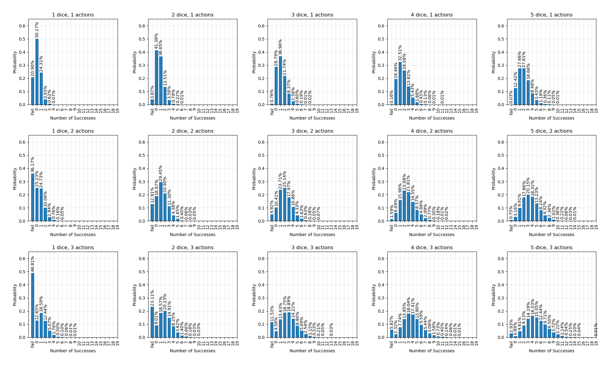

# Dark Veil Dice Roll Simulator

This Python script simulates and visualizes the probability distribution of dice rolls in the Dark Veil system. It helps understand the statistical outcomes of different combinations of dice and rolls.

## Features

- Simulates Dark Veil dice rolls with the following rules:
  - Roll d6 dice
  - 6s are successes and explode (roll again)
  - 5s are successes
  - 1s burn the die (can't be used again)
  - If all dice are burned, it's a critical failure
- Generates probability distributions for different combinations of:
  - Number of dice (1-5)
  - Number of rolls (1-3)
- Creates a comprehensive visualization showing all combinations

## Usage

Run the script with Python:

```bash
python dark-veil.py
```

To save the plot instead of displaying it:

```bash
python dark-veil.py --plot
```

## Example Output

The script generates a plot showing the probability distribution for each combination of dice and rolls:



Each subplot shows:
- The probability of getting different numbers of successes
- The probability of critical failure (marked as "Fail")
- Percentage labels for each outcome 